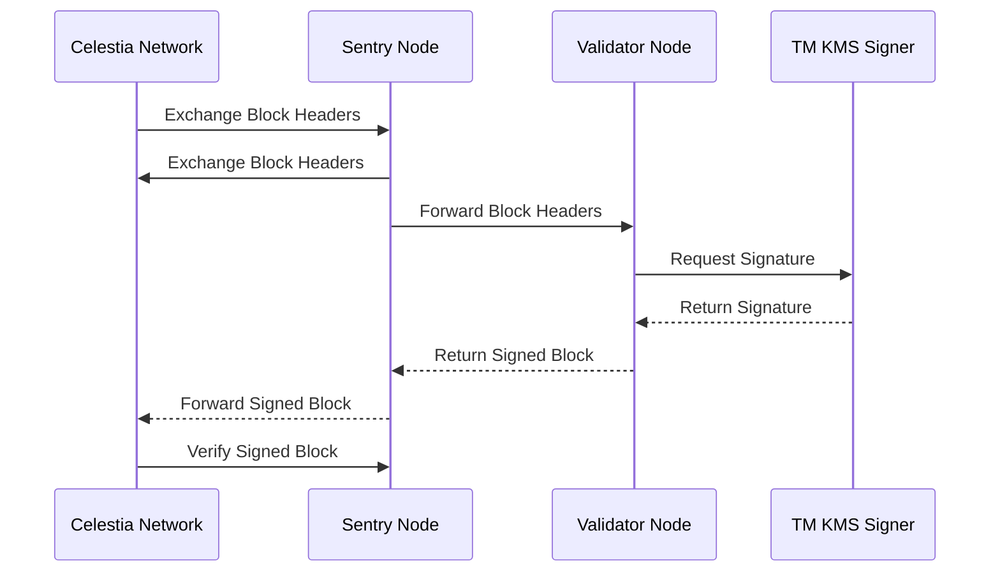

# Celestia Validator and Sentry Node Setup

This guide provides instructions for using playbooks to install a Celestia validator and a sentry node. The setup ensures secure and efficient operation of the validator by allowing it to communicate only through sentry nodes. 

Overall

 - Sentry nodes can connect with other network nodes
 - Validators can connect with only Sentry nodes, but not the network.

and enhancing security. 

The validator utilizes [tmkms](https://github.com:iqlusioninc/tmkms.git) to sign , ensuring integrity and non-repudiation.

## Architecture Overview

    

## Prerequisites

-   Ansible installed on your control machine.
-   Access to target servers for the validator and sentry nodes.

## Configuration

Before deploying, you need to modify the configuration files according to your setup:

-   `group_vars/sentry.yml` for sentry node configurations.
-   `group_vars/validator.yml` for validator node configurations.

These YAML files allow you to specify the necessary parameters.

## Deployment Commands

To deploy the Celestia validator and sentry nodes, follow these steps:

1.  **Prepare Your Inventory File**

Ensure your Ansible inventory file is up to date with the IPs or hostnames of your target servers.

2.  **Edit Configuration Files**

Customize `group_vars/sentry.yml` and `group_vars/validator.yml` according to your needs.

3.  **Run the Playbook for Sentry Nodes**

`ansible-playbook -i your_inventory_file sentries.yml` 

4.  **Run the Playbook for Validator Nodes**

`ansible-playbook -i your_inventory_file validators.yml` 

Replace `your_inventory_file` with the path to your actual inventory file.

# Post Deployment Guide 

 The process involves obtaining identifiers for your nodes and configuring Sentry and Validator nodes for proper network interaction.

## Obtaining Node Identifiers

You'll need to gather some key identifiers for each node.

### Getting a NodeID

-   **NodeID**: This unique identifier for each node can be obtained by executing the following command:
    
-   `curl localhost:26657/status | jq '.result.node_info.id'` 
    
    This command queries the node's status and extracts the `NodeID`.
    
### Generating a PeerID

-   **PeerID**: This identifier is used for establishing peer connections and is derived from the `NodeID`. The format for a `PeerID` is: `<NodeID>@<host>:<port>` 
    
    Replace `<NodeID>`, `<host>`, and `<port>` with your node's specific details.

## Configuration Steps

With the identifiers obtained, you'll now configure Sentry and Validator nodes.

### On Sentry Nodes

-   **Configuring `private_peer_ids`**:
  
    -   Update the `private_peer_ids` setting in your node's configuration with the `NodeID` of the Validator. This step ensures that Sentry nodes do not broadcast Validator node details to the rest of the network.
    
               private_peer_ids = "<Validator_NodeID>" 
        

### On Validator Nodes

-   **Configuring `persistent_peers`**:
  
    -   Update the `persistent_peers` setting with the `PeerID` of each Sentry node. If you have multiple Sentry nodes, list their `PeerIDs` separated by commas.
    -   This configuration ensures that your Validator nodes maintain a persistent connection to your Sentry nodes, facilitating reliable communication.
    -   Example configuration for a single Sentry node:
        
                persistent_peers = "<Sentry_PeerID>"
    
    -   For multiple Sentry nodes:

               persistent_peers = "<Sentry_PeerID1>,<Sentry_PeerID2>"
        

Ensure to restart the nodes.
