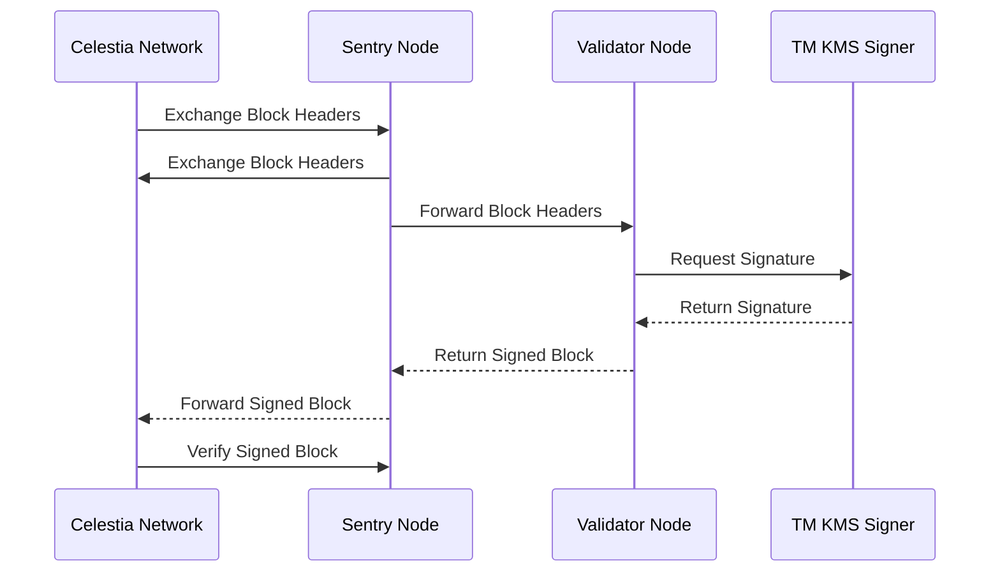

# Celestia Validator and Sentry Node Setup

This guide provides instructions for using playbooks to install a Celestia validator and a sentry node. The setup ensures secure and efficient operation of the validator by allowing it to communicate only through sentry nodes. 

Overall

 - Sentry nodes can connect with other network nodes
 - Validators can connect with only Sentry nodes, but not the network.

and enhancing security. 

The validator utilizes `tmkms` to sign transactions, ensuring integrity and non-repudiation.

## Architecture Overview

    

## Prerequisites

-   Ansible installed on your control machine.
-   Access to target servers for the validator and sentry nodes.
-   Basic understanding of YAML for editing configuration files.

## Configuration

Before deploying, you need to modify the configuration files according to your setup:

-   `group_vars/sentry.yml` for sentry node configurations.
-   `group_vars/validator.yml` for validator node configurations.

These YAML files allow you to specify the necessary parameters and settings tailored to your infrastructure and security requirements.

## Deployment Commands

To deploy the Celestia validator and sentry nodes, follow these steps:

1.  **Prepare Your Inventory File**

Ensure your Ansible inventory file is up to date with the IPs or hostnames of your target servers.

2.  **Edit Configuration Files**

Customize `group_vars/sentry.yml` and `group_vars/validator.yml` according to your needs.

3.  **Run the Playbook for Sentry Nodes**

`ansible-playbook -i your_inventory_file sentries.yml` 

4.  **Run the Playbook for Validator Nodes**

`ansible-playbook -i your_inventory_file validators.yml` 

Replace `your_inventory_file` with the path to your actual inventory file.
